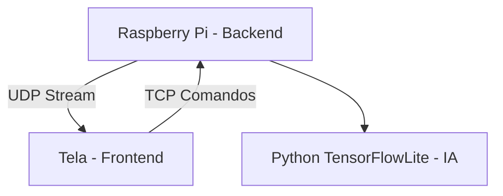

# 🍓 Strawberry AI - Repositório Umbrella

[](LICENSE)
[](https://www.python.org/)

Bem-vindo ao **Strawberry AI**, um sistema completo para **detecção de pragas em morangos**. Este repositório funciona como um **umbrella**, centralizando:

- Documentação
- Diagramas
- Links para os repositórios principais do projeto

---

## 📂 Repositórios Principais

| Módulo   | Linguagem              | Descrição                                                                     | Link                                                                                    |
| -------- | ---------------------- | ----------------------------------------------------------------------------- | --------------------------------------------------------------------------------------- |
| Backend  | Python                 | Captura vídeo do Raspberry Pi, envia frames via UDP e recebe comandos via TCP | [strawberry-backend-python](https://github.com/imtavin/strawberry-backend-python.git)   |
| Frontend | Python + CustomTkinter | Exibe vídeo, recebe comando do usuário e envia ao backend                     | [strawberry-frontend-python](https://github.com/imtavin/strawberry-frontend-python.git) |
| IA       | Python ML              | Detecta pragas nas imagens enviadas pelo backend                              | [strawberry-ai-model](https://github.com/seu-usuario/strawberry-ai-model)               |

---

## 🔹 Arquitetura do Sistema

O sistema possui três módulos principais: **Backend**, **Frontend** e **IA**. A comunicação ocorre via **UDP (stream de vídeo)** e **TCP (comandos)**.



### Descrição dos módulos:

- **Backend**: captura vídeo da câmera do Raspberry Pi, envia frames por UDP e recebe comandos TCP do frontend.
- **Frontend**: exibe o vídeo em tempo real e envia comandos ao backend (ex.: iniciar/parar detecção).
- **IA**: processa as imagens e detecta pragas, retornando os resultados ao backend.

---

## 📂 Estrutura do Repositório

```
.
├── backend/     -> submódulo do strawberry-backend-python
├── frontend/    -> submódulo do strawberry-frontend-python
├── ai/          -> submódulo do strawberry-ai-model
├── docs/        -> documentação, diagramas e fluxos
└── scripts/     -> scripts utilitários (ex: install_services.sh)
```

---

## 🔧 Como Rodar o Sistema

### 1. Clonar o repositório com submódulos

```bash
git clone --recurse-submodules https://github.com/imtavin/strawberry-ai.git
cd strawberry-ai
```

### 2. Instalar os serviços

```bash
cd scripts
chmod +x install_services.sh
./install_services.sh
```

### 3. Iniciar os módulos

```bash
sudo systemctl start strawberry-backend
sudo systemctl start strawberry-frontend
```

### 4. Parar os serviços

```bash
sudo systemctl stop strawberry-backend
sudo systemctl stop strawberry-frontend
```

---

## 🛠️ Desenvolvimento

Use **Python 3.13** ou superior.

Crie um ambiente virtual para instalar dependências:

```bash
python -m venv venv
# Linux / macOS
source venv/bin/activate
# Windows
venv\Scripts\activate

pip install -r requirements.txt
```

Para atualizar submódulos:

```bash
git submodule update --remote --merge
```

---
