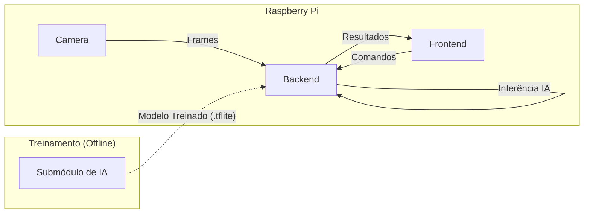
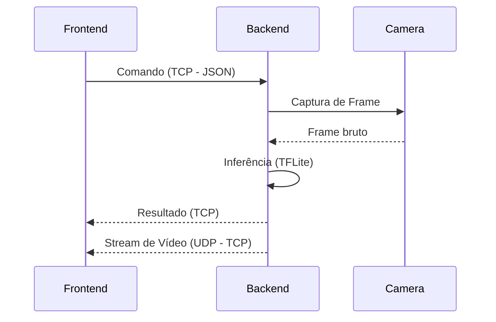

# Strawberry AI

## Sistema Embarcado com Inteligência Artificial para Detecção e Classificação de Pragas em Morangos

**Trabalho de Conclusão de Curso (TCC) – Engenharia da Computação**  
Universidade Positivo – 2025

### Autores
- Amanda Ribas Lima  
- Artur Pires Amador  
- Gustavo Tavares Espenchitt  

**Orientador:** Prof. Marlon André Peron Generoso

---

## Visão Geral

O **Strawberry AI** é um sistema embarcado desenvolvido para a detecção e classificação automática de pragas em morangueiros, utilizando técnicas de visão computacional e aprendizado profundo executadas localmente em hardware de baixo custo, como a Raspberry Pi.

O sistema realiza captura de imagem sob demanda, processamento local e inferência em tempo real, exibindo os resultados diretamente em uma interface gráfica embarcada, sem dependência de serviços em nuvem, tornando-o adequado para ambientes agrícolas com conectividade limitada.

O repositório Strawberry AI é um repositório *umbrella*, estruturado por meio de submódulos Git, separando claramente as responsabilidades de treinamento do modelo, execução embarcada e interface gráfica.

---

## Visão Física do Sistema

### Modelo 3D do Dispositivo

O modelo 3D representa o encapsulamento físico do sistema, projetado para uso em campo agrícola. O invólucro acomoda a Raspberry Pi, câmera, banco de baterias, circuito de alimentação e periféricos, garantindo portabilidade, proteção mecânica e organização interna.


### Diagrama Elétrico – Alimentação

O sistema é alimentado por um banco de baterias Li-Ion, gerenciado por um **BMS (Battery Management System)**, responsável por:

- Proteção contra sobrecarga  
- Proteção contra subtensão  
- Proteção contra curto-circuito  
- Balanceamento das células  

A saída do BMS alimenta um conversor DC-DC *step-down* (buck), que regula a tensão para níveis compatíveis com a Raspberry Pi e demais periféricos, garantindo estabilidade elétrica e segurança operacional.


---

## Problema Abordado

- Identificação tardia de pragas em cultivos de morango  
- Dependência de inspeção visual humana e subjetiva  
- Alto custo de soluções comerciais existentes  
- Limitações de conectividade em áreas rurais  
- Baixa escalabilidade de métodos tradicionais  

---

## Proposta da Solução

- Sistema embarcado portátil e autônomo  
- Execução local de redes neurais convolucionais  
- Inferência em tempo real sem dependência de internet  
- Interface gráfica embarcada para operação em campo  
- Arquitetura modular e escalável  
- Comunicação interna via TCP e UDP  

---

## Arquitetura Geral do Sistema


```mermaid
flowchart LR
    Camera -->|Frames| Backend
    Backend -->|Inferência IA| Backend
    Backend -->|Resultados| Frontend
    Frontend -->|Comandos| Backend

    subgraph Raspberry_Pi["Raspberry Pi"]
        Camera
        Backend
        Frontend
    end

    subgraph Treinamento_Offline["Treinamento (Offline)"]
        IA["Submódulo de IA"]
    end

    IA -.->|"Modelo Treinado (.tflite)"| Backend
```

- O submódulo de IA é utilizado exclusivamente para treinamento.  
- O modelo treinado é exportado e incorporado ao backend.  
- A inferência ocorre apenas no sistema embarcado.  

---

## Comunicação Interna


```mermaid
sequenceDiagram
    participant Frontend
    participant Backend
    participant Camera

    Frontend->>Backend: Comando (TCP - JSON)
    Backend->>Camera: Captura de Frame
    Camera-->>Backend: Frame bruto
    Backend->>Backend: Inferência (TFLite)
    Backend-->>Frontend: Resultado (TCP)
    Backend-->>Frontend: Stream de Vídeo (UDP - TCP)
```

### Protocolos

**TCP**
- Envio de comandos  
- Retorno de resultados  
- Comunicação confiável baseada em mensagens JSON  
- Streaming de vídeo em tempo real  

**UDP**
- Streaming de vídeo em tempo real  
- Baixa latência  
- Menor sobrecarga de comunicação  

---

## Submódulos do Repositório

### ia/ — Treinamento do Modelo
Responsável exclusivamente pelo treinamento e validação da IA.

- Transfer Learning com MobileNetV2  
- Data augmentation avançado  
- Geração de métricas (Precision, Recall, F1-score)  
- Exportação para `.h5` e `.tflite`  

Não executado em produção.

### backend/ — Sistema Embarcado
Responsável por:

- Captura de imagens  
- Pré-processamento  
- Inferência com TensorFlow Lite  
- Comunicação TCP/UDP  
- Integração com systemd  
- Controle geral do sistema  

### frontend/ — Interface Gráfica
Interface gráfica embarcada desenvolvida com CustomTkinter:

- Visualização do stream de vídeo  
- Acionamento da captura  
- Exibição dos resultados  
- Configurações de rede  
- Indicadores de estado do sistema  

### docs/
Documentação técnica e texto completo do TCC em LaTeX.

### scripts/
Scripts de deploy, automação e configuração de serviços.

---

## Estrutura do Repositório

```
.
├── backend/
├── frontend/
├── ia/
├── docs/
└── scripts/
```

---

O deploy do Strawberry AI é realizado **por meio de um script automatizado**, responsável por configurar todo o ambiente do sistema embarcado, sem necessidade de etapas manuais adicionais.

O script executa automaticamente:

- Criação da estrutura de diretórios em `/opt/strawberry-ai`;
- Instalação de dependências do sistema e do Python;
- Criação e validação de ambientes virtuais (venv);
- Ajuste de permissões de arquivos e scripts;
- Configuração do modo kiosk gráfico;
- Criação de scripts de inicialização;
- Criação e habilitação de serviços systemd;
- Configuração de auto-login no `tty1`;
- Inicialização automática do sistema no boot.

### Pré-requisitos

- Raspberry Pi OS
- Acesso sudo
- Git instalado
- Conectividade local para clonagem inicial do repositório

### Clonagem do Repositório

```bash
git clone --recurse-submodules https://github.com/imtavin/strawberry-ai.git
cd strawberry-ai
```

### Execução do Script de Deploy

O deploy completo do sistema é feito executando o script principal:

```bash
sudo bash scripts/deploy.sh
```

Ao final da execução, o sistema estará totalmente configurado e pronto para uso, sem necessidade de intervenções manuais adicionais.

### Serviços Criados

O script de deploy cria e habilita automaticamente os seguintes serviços:

strawberry-backend.service
Responsável por iniciar o backend do sistema, realizar inferência com TensorFlow Lite e disponibilizar os serviços TCP/UDP.

strawberry-kiosk.service
Responsável por iniciar o ambiente gráfico em modo kiosk, exibir o vídeo de inicialização e carregar a interface gráfica embarcada.

Ambos os serviços são configurados para reinício automático em caso de falha.

### Inicialização Automática

Após o deploy:

- O sistema inicia automaticamente no boot da Raspberry Pi;

- O usuário raspi é autenticado automaticamente no tty1;

- O backend é iniciado primeiro;

- Em seguida, a interface gráfica é carregada em modo kiosk;

- O sistema passa a operar de forma totalmente autônoma.

- Não é necessário executar comandos manuais de systemctl após o deploy inicial.
---

## Restrições

- Operação totalmente offline  
- Dependente da qualidade do dataset  
- Limitado pelo hardware embarcado  
- Projeto acadêmico sem fins comerciais  

---

## Licença

Projeto acadêmico desenvolvido para fins educacionais, como parte de um Trabalho de Conclusão de Curso em Engenharia da Computação.

---

## Considerações Finais

O Strawberry AI demonstra a viabilidade da aplicação de inteligência artificial embarcada na agricultura de precisão, integrando hardware, software e aprendizado profundo em um sistema funcional, modular e replicável.
